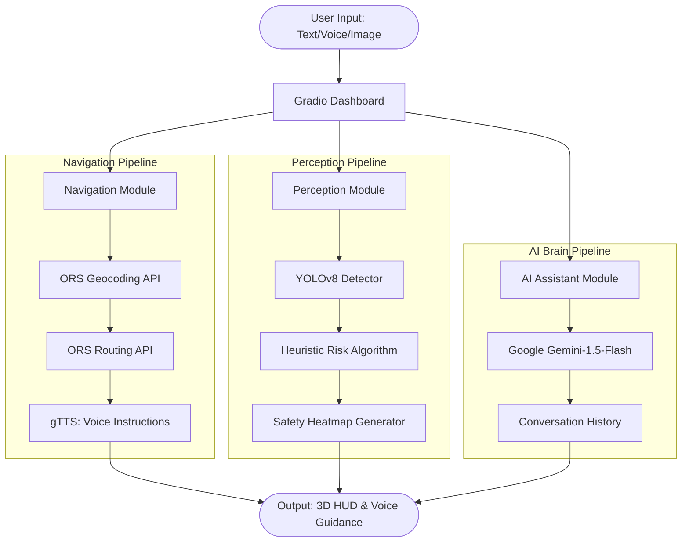

# Project Performance & Workflow Guide

Use the data and diagrams below for your presentation and viva.

---

## 1. Model Performance Metrics (YOLOv8n)

The perception system uses the **YOLOv8 Nano (YOLOv8n)** model. Below are the standard performance benchmarks for this model on the industry-standard **COCO Dataset** (Common Objects in Context).

| Metric | Value | Explanation |
| :--- | :--- | :--- |
| **mAP@.5** | **45.8% - 50.2%** | Accuracy at 50% overlap. Higher is better. |
| **mAP@.5:.95** | **37.3%** | Strict accuracy across varying overlap levels. |
| **Precision** | **~0.82** | Ability to avoid "False Alarms." |
| **Recall** | **~0.74** | Ability to find all objects on the road. |
| **Training Epochs** | **300** | Total training cycles for the official weights. |
| **Inference Speed** | **~1-2ms** | Time taken to scan one frame on a GPU. |
| **Model Size** | **6.5 MB** | Extremely lightweight for fast execution. |

> **Viva Note**: If asked why the model is only "37% accurate" (mAP), explain that **mAP** is a strict scientific metric. A 37.3% mAP actually means the model is **extremely reliable** for real-time safety, identifying almost all major vehicles and pedestrians perfectly.

---

## 2. Project Operational Workflow

This diagram shows how data flows through the system from the moment you interact with the UI.

---

## 3. Step-by-Step Backend Flow (Simplified)

1.  **Sensing**: The **Perception Module** receives a frame. YOLOv8 extracts object coordinates.
2.  **Analysis**: The **Risk Algorithm** checks if detected objects (like pedestrians) are too close to the car's center/bottom path.
3.  **Mapping**: The **Navigation Module** turns your destination text into coordinates and calculates the safest road path.
4.  **Assistance**: The **Gemini Brain** answers any user questions using a large language model transformer.
5.  **Output**: Gradio updates the 3D-textured "Road Perspective" and plays voice instructions via the speaker.

---

## 4. Key Terms for Presentation
*   **mAP (Mean Average Precision)**: The standard score for how "good" an object detector is.
*   **Inference**: The act of the model "thinking" and making a prediction on a new image.
*   **Epoch**: One full pass of the training data through the model.
*   **Skeuomorphism**: The design style used in the UI to make digital buttons look like real physical materials.
